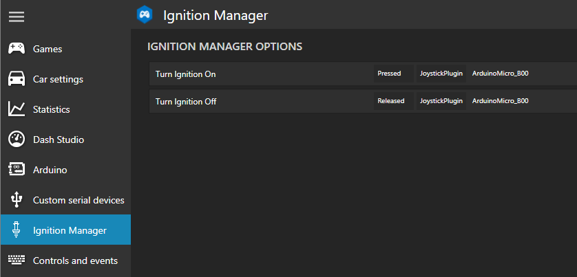

# Ignition Manager

SimHub Plugin to use a physical switch for ignition on/off.

This allows you to set your ignition (e.g. on a button box) to ON and this state will be enforced in the game.

## Functionality

* when game data change
* check current status of ingame ignition
* check physical switch status
* press ignition button ingame to toggle to correct status

## Usage

Simply add key bindings to the plugin provided actions `Turn Ignition On` and `Turn Ignition Off`.
Make sure one action is `pressed` and the other one is `released`.

In your game set the binding for `ignition toggle` to the keyboard key `I`,
as that is the default button simulated by the plugin.

